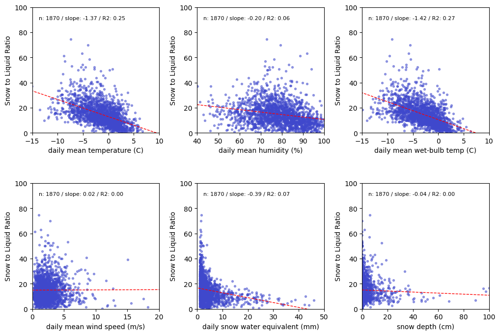
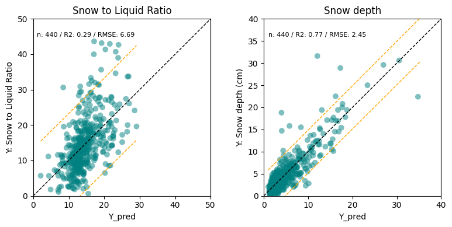

# Snow-to-Liquid Ratio study
A statistical analysis of the relationship between surface observations and Snow-to-Liquid Ratio  

**Notebook Link**:   
https://colab.research.google.com/github/hunter3789/SLR-study/blob/main/SLR-study.ipynb

**Intro**:  
- Accurate winter snowfall forecasting requires not only precise precipitation prediction but also consideration of the Snow-to-Liquid Ratio (SLR), which determines how much snowfall accumulates from a given amount of liquid precipitation.
- SLR varies depending on snow particle characteristics and compaction effects and is highly sensitive to subtle atmospheric conditions such as temperature changes, making it difficult to characterize accurately.
- Using snowfall observations from laser snow depth sensors (introduced by KMA in 2014; currently 643 sites), this study analyzes (1) the relationship between surface meteorological variables and SLR, and (2) regional differences in SLR characteristics.

**Exploratory Data Analysis**:  

- Temperature, humidity, wet-bulb temperature, Snow Water Equivalent (SWE), and snow depth all show negative correlations with SLR.
- Higher temperature and humidity reduce SLR due to changes in snow crystal formation.
- Larger SWE and existing snow depth reduce SLR through compaction effects.
- Wind speed showed no significant correlation with SLR, while some previous studies (Ware et al., 2006) suggest wind may reduce SLR via snow crystal fracturing.
- Wet-bulb temperature had a slightly higher correlation with SLR than air temperature.

**Statistical Significance – Linear Regression Model**

- Linear regression was used to test statistical significance of predictors.
- Wet-bulb temperature, SWE (Snow Water Equivalent), and snow depth were all statistically significant (p < 0.001).
- Wet-bulb temperature was used as a representative variable to avoid multicollinearity.

**Regional (Mechanism-Based) Differences in SLR**
